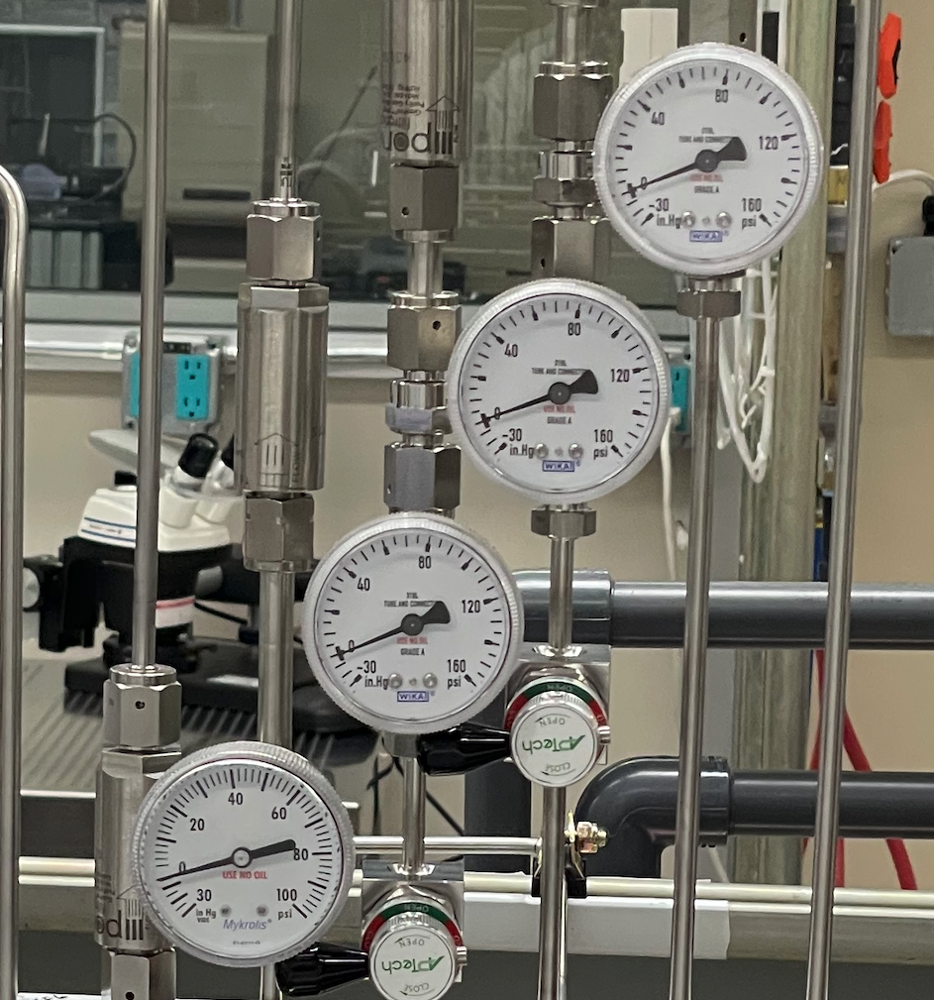

# Smart Camera

## Introduction
The Stanford Nanofabrication Facility's *Smart Camera* is a purpose-built camera module designed to monitor the dials, numeric readouts, and other indicators on nanofabrication equipment. Its camera captures and then locally processes images of the tool to extract desired information. On board solar panels powers the module from anywhere in the cleanroom, without the need to plug it in. WiFi capabilities support diverse 

Currently, the Smart Camera can monitor the following objects:

|  |  |  |  |
|----------|----------|----------|----------|
| | Full Face| Partial Face | Rotameter |
| Dials |  |  |  |
| | 7-Segment | General Text |
| Digital Readouts |  |  |
| | LED Indicator | Stack Lights |
| Status Indicators |  |  |

## Setup

Download the Smart Camera GUI to setup a new Smart Camera.